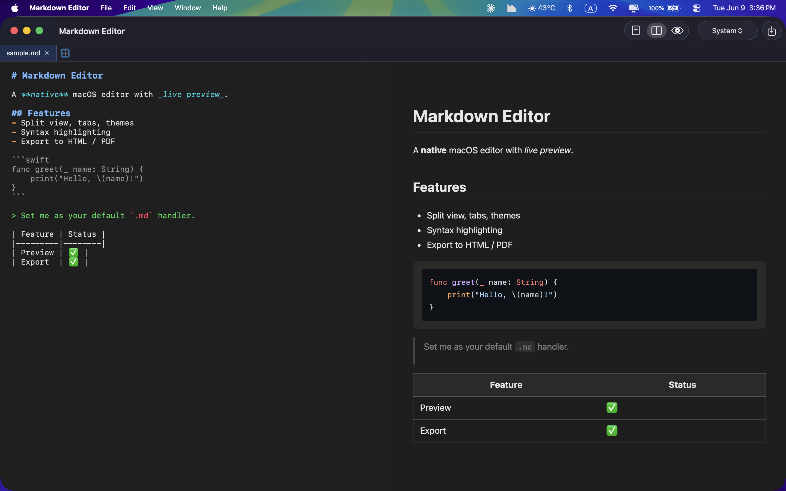

# Markdown Editor

A native macOS markdown editor with live preview, built in SwiftUI. Installable as a
`.app` and registrable as the default handler for `.md` / `.markdown` files.



## Features

- **Split editor + live preview** — toggle Editor / Split / Preview from the toolbar
- **In-editor syntax highlighting** — headings, bold/italic, lists, code, quotes, links
- **Rendered preview** — GFM tables, task lists, and code-block syntax highlighting
  (marked + highlight.js, bundled — works fully offline)
- **Tabs** — open multiple documents in one window
- **Themes** — System / Light / Dark
- **Find & replace** — native ⌘F find bar in the editor
- **Export** — HTML and PDF
- **File association** — opens `.md` from Finder / "Open With" / default handler

## Build & install

```bash
./build_app.sh                      # produces build/Markdown Editor.app
cp -R "build/Markdown Editor.app" /Applications/
```

`build_app.sh` compiles a release binary, assembles the `.app` bundle, generates the
icon, ad-hoc code-signs it, and registers it with Launch Services.

## Set as the default markdown app

```bash
swift set_default.swift
```

Or manually: right-click any `.md` file → **Get Info** → **Open with** → *Markdown Editor*
→ **Change All…**. (Only the markdown content type is claimed — plain `.txt` files are
left alone.)

## Keyboard shortcuts

| Action      | Shortcut |
|-------------|----------|
| New / New Tab | ⌘N / ⌘T |
| Open        | ⌘O |
| Save / Save As | ⌘S / ⇧⌘S |
| Close Tab   | ⌘W |
| Find        | ⌘F (editor focused) |

## Project layout

```
Package.swift                 SwiftPM manifest (executable + bundled web resources)
Info.plist                    Bundle config + markdown document-type declarations
build_app.sh                  Build → .app → sign → register
make_icon.swift               Generates the AppIcon
set_default.swift             Sets the default .md handler
Sources/MarkdownEditor/
  App.swift                   App entry, menu commands, file-open delegate
  Models.swift                Document & Workspace state
  ContentView.swift           Tab bar, toolbar, split layout
  EditorView.swift            NSTextView + live syntax highlighting
  PreviewView.swift           WKWebView preview + PDF/HTML export
  FileService.swift           Open / save / export
  Resources/web/              index.html, marked, highlight.js, themes
```

## Requirements

macOS 13+, Xcode / Swift 5.9+.
